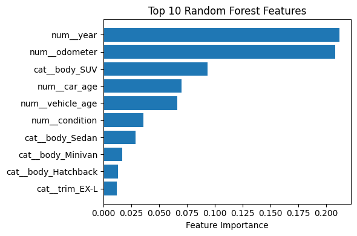
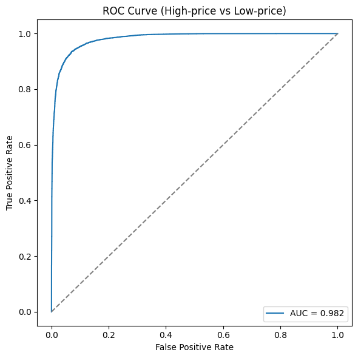

# Car Sales Price Prediction

## Project Description
Prognostiziert den Verkaufspreis von Gebrauchtwagen anhand von Marke, Modell, Baujahr, Zustand, Kilometerstand und regionalen Faktoren.

## Results
*Ergebnisse hier eintragen, z. B. Performance der finalen Modelle und Interpretation.*

### Name & URL
| Name         | URL |
|--------------|-----|
| Huggingface  | [Space URL](https://huggingface.co/spaces/steffchi/car_price_prediction) |
| Code         | [GitHub Repository](https://github.com/chiarasteffen/car_sales_prediction) |

## Data Sources and Features Used Per Source
| Data Source      | Features                                                                 |
|------------------|--------------------------------------------------------------------------|
| [Kaggle](https://www.kaggle.com/datasets/zaynalabidin/car-sales-prices) | year, make, model, trim, body, transmission, vin, state, condition, odometer, color, interior, seller, mmr, sellingprice, saledate |
| [Kaggle](https://www.kaggle.com/datasets/akk26001/us-and-canada-states)     | StateCode, StateName, Region, AlternateName |

Anfangs wurde für die Staaten die Quelle [Kaggle](https://www.kaggle.com/datasets/omer2040/usa-states-to-region) herangezogen. Da dieses Dataset jedoch nur US-Bundesstaaten enthält und keine kanadischen Provinzen abdeckt, kam anschliessend eine alternative Datenquelle zum Einsatz. Einen ersten Test mit diesem Datensatz finden Sie in diesem [Notebook](z_archive/data/V1_01_data_preprocessing_and_ingestion.ipynb).

## Features Created
| Feature | Description  | Creation  |
|---------|-------------|-------------|
| **sale_year**, **sale_month**, **sale_day**, **sale_weekday** | Zeitkomponenten des Verkaufsdatums | Extraktion aus `saledate` via `.dt.year/.month/.day/.weekday`|
| **state_clean**, **state_code**, **state_name**, **state_region** | Bereinigte und gematchte Staatsinformationen | Strip und Uppercase, dann Merge mit `states`-Lookup-Tabelle |
| **car_age** | Alter des Fahrzeugs | `sale_year` − `year`  |
| **avg_price_state** | Durchschnittlicher Verkaufspreis pro Bundesstaat| Gruppenmittel aller `sellingprice` nach `state_code` |
| **median_price_state** | Medianer Verkaufspreis pro Bundesstaat | Gruppenmedian aller `sellingprice` nach `state_code` |
| **season** | Jahreszeit des Verkaufs | Mapping `sale_month` → {Winter, Fruehling, Sommer, Herbst} |
| **mean_price_make_model_season** | Durchschnittspreis je Marke‐Modell‐Jahreszeit | Gruppenmittel von `sellingprice` für jede (`make`, `model`, `season`)-Kombination |
| **has_sport**, **has_limited**, **has_lx**, **has_se**, **has_touring**, **has_premium** | Stichwort‐Flags aus Trim/Model | `.str.contains(kw)` auf Spalten `trim` und `model` für je ein Keyword |
| **vehicle_age** | Fahrzeugalter (Vorstufe für Jahresfahrleistung) | `sale_year` − `year` mit 0→1 Korrektur |
| **miles_per_year** | Durchschnittliche Jahresfahrleistung | `odometer` ÷ `vehicle_age` |
| **color_popularity** | Rang der Lackfarbe nach Häufigkeit | Dichte‐Rang der Werte in `color` (1 = häufigste Farbe) |

## Model Training
### Amount of Data
- Gesamtzahl Datensätze: 98'129 Autos

Eine Übersicht der Datenreduktion findet sich in [Notebook 1](notebooks/01_data_import_merge_aufbereitung.ipynb):

| Schritt                   | Beschreibung                                                         | Verbleibende Datensätze |
|---------------------------|----------------------------------------------------------------------|------------------------:|
| Nach Merge                | 558 825 Zeilen eingelesen, 26 Zeilen mit ungültigem State-Code entfernt | 558 799                |
| Schritt 6 (bereinigen)    | Fehlende Werte in kritischen Spalten, color, interior, odometer entfernt | 472 325                |
| Schritt 7 (Ausreisser)     | Werte ausserhalb 1–99 %-Quantil in numerischen Spalten entfernt          | 451 390                |
| Schritt 8 (Top-K-Filter)  | Filtern nach Top-10 Marken, Top-5 Regionen und Top-6 Karosserien        | 251 282                |
| Schritt 9.1 (Top-5 Marken)| Nur Ford, Nissan, Chevrolet, Toyota, Honda beibehalten                 | 161 350                |
| Schritt 9.2 (Sampling)    | Random Sampling pro Marke auf Endgrösse                                  | 98 129                 |

### Data Splitting Method (Train/Validation/Test)
- **Gesamtaufteilung (80/20)**  
  Der bereinigte Datensatz (98 129 Autos) wurde mit `train_test_split` in  
  - 80 % Trainingsdaten  
  - 20 % Testdaten  
  aufgeteilt (Zufalls-Seed = 42).

- **Validierung via Cross-Validation**  
  Anstelle eines fixen Validierungssets wurde auf den Trainingsdaten eine 3-fach-K-Fold-Cross-Validation eingesetzt:  
  - **Lineare Regression**: 3-Fold-CV auf dem vollständigen Trainingsset  
  - **Random Forest**: Zur Beschleunigung wurde nur 30 % des Trainingssets zufällig ausgewählt, und darauf ebenfalls 3-Fold-CV gefahren.

- **Finales Training & Test-Evaluation**  
  Nachdem das bessere Modell (Random Forest) per CV ermittelt wurde, wurden beide Baseline-Modelle jeweils auf dem gesamten Trainingsset trainiert und anschliessend auf dem Testset evaluiert (MAE, RMSE, R²).

### Performance
| It. Nr | Model                                | Performance                                                                                              | Features                                           | Description                                            |
|--------|--------------------------------------|----------------------------------------------------------------------------------------------------------|----------------------------------------------------|--------------------------------------------------------|
| 1      | Linear Regression (mit MMR)          | Train → MAE: 887.85, RMSE: 1301.62, R²: 0.9318 Test → MAE: 893.45, RMSE: 1306.29, R²: 0.9322            | Alle originalen Features inkl. `mmr`                | Baseline-Performance mit MMR                           |
| 2      | Random Forest (mit MMR)              | Train → MAE: 288.16, RMSE: 423.44, R²: 0.9928 Test → MAE: 778.56, RMSE: 1141.82, R²: 0.9482            | Alle originalen Features inkl. `mmr`                | Starker Overfitting durch MMR-Leak                     |
| 3      | Random Forest (ohne MMR)             | Train → MAE: 671.21, RMSE: 912.90, R²: 0.9659 Test → MAE: 1804.50, RMSE: 2441.23, R²: 0.7567           | Ohne `mmr`, Ausreisser gefiltert, `median_price_state` entfernt | Baseline nach MMR-Entfernung                           |
| 4      | Random Forest (getunt)               | Train → MAE: 1126.92, RMSE: 1538.00, R²: 0.9033 Test → MAE: 1781.53, RMSE: 2405.00, R²: 0.7639          | Wie It. 3 + Hyperparameter-Tuning                   | Overfitting reduziert, leichte Test-Verbesserung       |
| 5      | GradientBoostingRegressor            | CV RMSE: 2539.35 ± 17.85 Train → MAE: 1913.80, RMSE: 2527.95, R²: 0.7387 Test → MAE: 1913.43, RMSE: 2531.92, R²: 0.7383 | Wie It. 3                                           | Alternative Modellklasse, geringere Genauigkeit        |
| 6      | Random Forest (erweiterte Features)  | Train → MAE: 1096.89, RMSE: 1498.45, R²: 0.9082 Test → MAE: 1788.88, RMSE: 2414.38, R²: 0.7620          | Wie It. 4 + neue Features (age, season, flags, cyclical, bins) | Neue Features bringen keinen Test-Gewinn               |
| 7      | Linear Regression (final)            | Test → MAE: 1369.15, RMSE: 1874.48, R²: 0.8605                                                            | Alle Features aus Notebook 1 ohne `mmr`             | Endgültige Evaluation der Linearen Regression         |
| 8      | Random Forest (final)                | Test → MAE: 921.82, RMSE: 1332.17, R²: 0.9295                                                            | Alle Features aus Notebook 1 ohne `mmr`             | Endgültige Evaluation – Random Forest als Bestes Modell |

## References
#### Interpretation der Random Forest Feature Importance

Im obigen Diagramm („FeatureImportance.png“) sind die zehn wichtigsten Merkmale des trainierten Random Forest Modells dargestellt. Folgende Erkenntnisse lassen sich daraus ableiten:

1. **„year“ und „odometer“ dominieren das Modell**  
   - Die Feature Importance von `num__year` (Baujahr) und `num__odometer` (Kilometerstand) liegt mit je rund 20 % an der Spitze.  
   - Das bedeutet: Alter und Laufleistung eines Fahrzeugs sind die stärksten Prädiktoren für den Verkaufspreis.  

2. **Karosserieform „SUV“ (cat__body_SUV) als drittwichtigstes Merkmal**  
   - Die Dummy-Variable `cat__body_SUV` (SUV-Karosserie) trägt mit knapp 10 % deutlich zur Modellgüte bei.  
   - SUVs erzielen tendenziell höhere Verkaufspreise, daher reagiert das Modell besonders darauf.  

3. **Fahrzeugalter („car_age“ bzw. „vehicle_age“) ergänzend relevant**  
   - `num__car_age` und `num__vehicle_age` liegen auf den Plätzen 4 und 5 mit jeweils ca. 7–8 %.  
   - Damit bestätigt sich, dass sowohl das Baujahr als auch das berechnete Alter in Jahren eng miteinander verwoben, aber separat informativ sind.  

4. **„condition“ spielt ebenfalls eine Rolle**  
   - Die Variable `num__condition` (Zustand) erscheint an sechster Stelle (~ 4 %).  
   - Gut gepflegte Fahrzeuge werden logisch mit höherem Preis bewertet.  

5. **Weitere Karosserie- und Trim-Flags (Sedan, Minivan, Hatchback, EX-L)**  
   - Auf den Plätzen 7–10 folgen u. a. `cat__body_Sedan`, `cat__body_Minivan`, `cat__body_Hatchback` und `cat__trim_EX-L`.  
   - Hier wird ersichtlich, dass nach den Top-Features weitere Modell- bzw. Ausstattungsklassen zwar relevant sind, jedoch nur noch moderaten Einfluss (< 3 %) auf den Preis haben.  

Zusammengefasst unterstreicht die Grafik, dass zeitliche Merkmale (Baujahr/Alter), Laufleistung und bestimmte Karosserieformen (vor allem SUVs) die wichtigsten Treiber im Preisvorhersage-Modell sind. Alle weiteren Dummy-Variablen (Sedan, Minivan etc.) haben nur noch einen vergleichsweise geringen Einfluss.

---

#### Interpretation der ROC-Kurve (High-price vs Low-price)

Die Datei „ROC.png“ zeigt die Receiver Operating Characteristic (ROC) für die binäre Einteilung „Verkaufspreis > Median“ versus „≤ Median“ auf dem Testset:

1. **AUC = 0.982**  
   - Der Area Under the Curve (AUC) Wert von 0.982 indiziert eine exzellente Trennschärfe zwischen hochpreisigen und niedrigpreisigen Fahrzeugen.  
   - Werte nahe 1.0 bedeuten, dass das Modell praktisch kaum Fehlklassifikationen macht, wenn man bedenkt, dass hierbei die kontinuierliche Regression in eine binäre Aufgabe übersetzt wurde.

2. **Kurve nahe der linken oberen Ecke**  
   - Die blaue ROC-Kurve verläuft direkt an der linken (FPR → 0) und oberen Achsen (TPR → 1), was zeigt, dass das Modell bei fast allen Schwellenwerten eine sehr hohe True-Positive-Rate erreicht, ohne viele False Positives zu produzieren.  
   - Je näher die Kurve an den Punkten (0,1) liegt, desto besser die diskrete Unterscheidung in „High-price“ vs. „Low-price“.

3. **Vergleich zur Diagonalen (Zufallslinie)**  
   - Die gestrichelte graue Linie bei 45 Grad (FPR = TPR) repräsentiert eine Zufallsklassifikation (AUC = 0.5).  
   - Da die ROC-Kurve deutlich darüber liegt, wird nochmals verdeutlicht, dass der Random Forest das Preisniveau sehr zuverlässig vorhersagt.

**Fazit:** Beide Grafiken zusammen bestätigen, dass  
- a) die wichtigsten Features gut identifiziert wurden (Feature Importance),  
- b) das Modell auch für die vereinfachte Klassifikationsaufgabe (High- vs. Low-Price) nahezu perfekt trennt (AUC ≈ 0.98).  
Dies untermauert die Wahl des Random Forests als finalem Modell für die Preisdiskretisierung und Regressionsaufgabe.  

