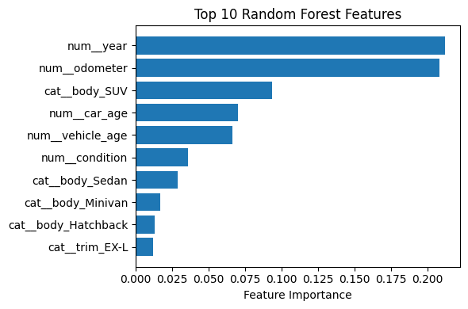
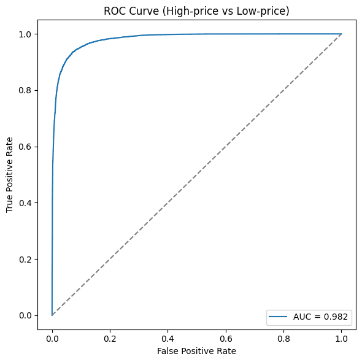

# Car Sales Price Prediction

## Projektbeschreibung
Schätzt Verkaufspreise von Gebrauchtwagen in den USA und Kanada mithilfe eines trainierten Random-Forest-Modells  

## Resultate
Das Random-Forest-Modell liefert auf dem Testset eine MAE von 921,82, eine RMSE von 1 332,17 und ein R² von 0,9295 und übertrifft damit die Lineare Regression (MAE = 1 369,15, RMSE = 1 874,48, R² = 0,8605). Auch die 3-fache Cross-Validation bestätigt die Robustheit des Random Forest (CV-RMSE = 1 564 ± 46 im Vergleich zu 1 767 ± 25 bei der Linearen Regression) und deutet auf nur geringes Overfitting hin (Test-RMSE 1 332 vs. CV-RMSE 1 564 auf 30 % der Trainingsdaten). Mit einer AUC von 0,982 trennt das Modell ausserdem hoch- und niedrigpreisige Fahrzeuge sehr zuverlässig. Insgesamt stehen 98 129 Datensätze zur Verfügung, aufgeteilt auf fünf Top-Marken (d.h. im Schnitt ≈ 19 600 Einträge pro Marke), wodurch seltener vertretene Marken, Modelle oder Regionen nur wenige Beispiele haben. Weitere Daten — insbesondere für weniger verbreitete Fahrzeugkombinationen — könnten die Vorhersagegenauigkeit insbesondere in Randbereichen noch verbessern.

### Name & URL
| Name         | URL |
|--------------|-----|
| Huggingface  | [Space URL](https://huggingface.co/spaces/steffchi/car_price_prediction) |
| Code         | [GitHub Repository](https://github.com/chiarasteffen/car_sales_prediction) |

## Data Sources and Features Used Per Source
| Data Source      | Features                                                                 |
|------------------|--------------------------------------------------------------------------|
| [Kaggle](https://www.kaggle.com/datasets/zaynalabidin/car-sales-prices) | year, make, model, trim, body, transmission, vin, state, condition, odometer, color, interior, seller, mmr, sellingprice, saledate |
| [Kaggle](https://www.kaggle.com/datasets/akk26001/us-and-canada-states)     | StateCode, StateName, Region, AlternateName |

Anfangs wurde für die Staaten die verlinkte Quelle von [Kaggle](https://www.kaggle.com/datasets/omer2040/usa-states-to-region) herangezogen. Da dieses Dataset jedoch nur US-Bundesstaaten enthält und keine kanadischen Provinzen abdeckt, kam anschliessend eine alternative Datenquelle zum Einsatz. Einen ersten Test mit diesem Datensatz finden Sie in diesem [Notebook](z_archive/V1_01_data_preprocessing_and_ingestion.ipynb).

## Features Created

| Feature                                          | Description                                                                                                                    | Creation                                                                                         |
|--------------------------------------------------|--------------------------------------------------------------------------------------------------------------------------------|--------------------------------------------------------------------------------------------------|
| **sale_year**, **sale_month**, **sale_day**, **sale_weekday** | Zeitkomponenten des Verkaufsdatums                                                                                              | Extraktion aus `saledate` via `.dt.year`, `.month`, `.day`, `.weekday`                            |
| **state_clean**, **state_code**, **state_name**, **state_region** | Bereinigte und gematchte Staatsinformationen                                                                                    | `strip()` & `upper()`, dann Merge mit `states`-Lookup-Tabelle                                      |
| **car_age**                                      | Alter des Fahrzeugs                                                                                                             | Berechnung: `sale_year` − `year`                                                                   |
| **avg_price_state**                              | Durchschnittlicher Verkaufspreis pro Bundesstaat                                                                                 | Gruppenmittel aller `sellingprice` nach `state_code`                                              |
| **median_price_state**                           | Medianer Verkaufspreis pro Bundesstaat                                                                                            | Gruppenmedian aller `sellingprice` nach `state_code`                                              |
| **season**                                       | Jahreszeit des Verkaufs                                                                                                          | Mapping `sale_month` → {Winter, Frühling, Sommer, Herbst}                                         |
| **mean_price_make_model_season**                  | Durchschnittspreis je Marke‐Modell‐Jahreszeit                                                                                     | Gruppenmittel von `sellingprice` für jede Kombination aus (`make`, `model`, `season`)            |
| **has_sport**, **has_limited**, **has_lx**, **has_se**, **has_touring**, **has_premium** | Stichwort-Flags aus `trim`/`model`                                                                                              | `.str.contains(kw)` auf Spalten `trim` & `model` für jedes Keyword                                |
| **vehicle_age**                                  | Fahrzeugalter (Vorstufe für Jahresfahrleistung)                                                                                  | Berechnung: `sale_year` − `year` (0→1-Korrektur bei Null)                                          |
| **miles_per_year**                               | Durchschnittliche Jahresfahrleistung                                                                                             | Berechnung: `odometer` ÷ `vehicle_age`                                                              |
| **color_popularity**                             | Rang der Lackfarbe nach Häufigkeit                                                                                                | Dichte‐Rang der Werte in `color` (1 = häufigste Farbe)                                             |

## Model Training

### Amount of Data  
- **Ausgang nach Merge:** 558 799 Datensätze  
- **Reduktionsschritte:**  
  | Schritt                  | Verbleibende Datensätze |
  |--------------------------|------------------------:|
  | Bereinigung              | 472 325                 |
  | Ausreisserentfernung      | 451 390                 |
  | Top-K-Filter (Marken/Regionen/Karosserie) | 251 282        |
  | Top-5 Marken             | 161 350                 |
  | Sampling pro Marke       | 98 129                  |

### Data Splitting Method (Train/Validation/Test)  
- **80 % / 20 % Split** (Random State = 42):  
  - 98 129 Datensätze → 78 503 Training / 19 626 Test  
- **3-Fold Cross-Validation** auf Trainingsdaten:  
  - **Lineare Regression:** 3-Fold CV auf vollem Trainingsset  
  - **Random Forest:** 3-Fold CV auf 30 % des Trainingssets (zufällige Stichprobe)  
- **Finales Training & Test-Evaluation:**  
  - Bestes Modell (Random Forest) und Lineare Regression auf gesamtem Trainingsset trainiert  
  - Evaluation auf Testset mittels MAE, RMSE, R²  

### Performance

| It. Nr | Model                                | Performance                                                                                              | Features                                           | Description                                            |
|--------|--------------------------------------|----------------------------------------------------------------------------------------------------------|----------------------------------------------------|--------------------------------------------------------|
| 1      | Linear Regression (mit MMR)          | Train → MAE: 887.85, RMSE: 1301.62, R²: 0.9318 Test → MAE: 893.45, RMSE: 1306.29, R²: 0.9322            | Alle originalen Features inkl. `mmr`                | Baseline-Performance mit MMR                           |
| 2      | Random Forest (mit MMR)              | Train → MAE: 288.16, RMSE: 423.44, R²: 0.9928 Test → MAE: 778.56, RMSE: 1141.82, R²: 0.9482            | Alle originalen Features inkl. `mmr`                | Starker Overfitting durch MMR-Leak                     |
| 3      | Random Forest (ohne MMR)             | Train → MAE: 671.21, RMSE: 912.90, R²: 0.9659 Test → MAE: 1804.50, RMSE: 2441.23, R²: 0.7567           | Ohne `mmr`, Ausreisser gefiltert, `median_price_state` entfernt | Baseline nach MMR-Entfernung                           |
| 4      | Random Forest (getunt)               | Train → MAE: 1126.92, RMSE: 1538.00, R²: 0.9033 Test → MAE: 1781.53, RMSE: 2405.00, R²: 0.7639          | Wie It. 3 + Hyperparameter-Tuning                   | Overfitting reduziert, leichte Test-Verbesserung       |
| 5      | GradientBoostingRegressor            | CV → RMSE: 2539.35 ± 17.85 Train → MAE: 1913.80, RMSE: 2527.95, R²: 0.7387 Test → MAE: 1913.43, RMSE: 2531.92, R²: 0.7383 | Wie It. 3                                           | Alternative Modellklasse, geringere Genauigkeit        |
| 6      | Random Forest (erweiterte Features)  | Train → MAE: 1096.89, RMSE: 1498.45, R²: 0.9082 Test → MAE: 1788.88, RMSE: 2414.38, R²: 0.7620          | Wie It. 4 + neue Features (age, season, flags, cyclical, bins) | Neue Features bringen keinen Test-Gewinn               |
| 7      | Linear Regression (final)            | Test → MAE: 1369.15, RMSE: 1874.48, R²: 0.8605                                                            | Alle Features aus Notebook 1 ohne `mmr`             | Endgültige Evaluation der Linearen Regression         |
| 8      | Random Forest (final)                | Test → MAE: 921.82, RMSE: 1332.17, R²: 0.9295                                                            | Alle Features aus Notebook 1 ohne `mmr`             | Endgültige Evaluation – Random Forest als Bestes Modell |

## References

Die Grafik zeigt die **Top-10-Features** des Random‐Forest‐Modells:
- **`year` (Baujahr) & `odometer` (Kilometerstand)** belegen Spitzenplätze (je ∼20 % Importance), weil neuere Fahrzeuge mit geringer Laufleistung naturgemäss teurer sind.
- **`body_SUV` (SUV-Flag)** (∼10 %) unterstreicht, dass SUVs häufig höhere Preise erzielen und das Modell darauf stark reagiert.
- **`car_age` & `vehicle_age`** (je ∼7–8 %) ergänzen das Baujahr als zusätzliche Altersinfo und fangen Feinheiten im Preisverfall über die Zeit ab.
- **`condition`** (∼4 %) signalisiert, dass eine gute Fahrzeugpflege den Preis merklich beeinflusst.
- Weitere **Karosserie- und Trim-Dummy-Variablen** (< 3 %) liefern kleinere, aber teils spezifische Preisinformationen (z. B. Minivan vs. Hatchback).  
Insgesamt bestätigt sich, dass **Zeit- (Alter/Laufleistung) und Typ-Merkmale** (SUV, Zustand) die wichtigsten Preis­treiber sind.

---

Die **ROC-Kurve** für „High-Price vs. Low-Price“ (Schwellenwert = Median) zeigt:
- Eine **AUC von 0,982** – das Modell trennt hochpreisige von niedrigpreisigen Fahrzeuge nahezu perfekt.
- Die Kurve verläuft **nahe der oberen linken Ecke**, was darauf hindeutet, dass bei vielen Schwellenwerten die **True-Positive-Rate** sehr hoch ist, während die **False-Positive-Rate** gering bleibt.
- Im Vergleich zur **Zufallslinie (Diagonal)** demonstriert der Random Forest, dass er sehr zuverlässige Wahrscheinlichkeiten für Preisklassen liefert.  
Diese Ergebnisse belegen, dass das Modell nicht nur numerisch präzise ist, sondern auch in einer **vereinfachten Klassifikationsaufgabe** exzellent performt.